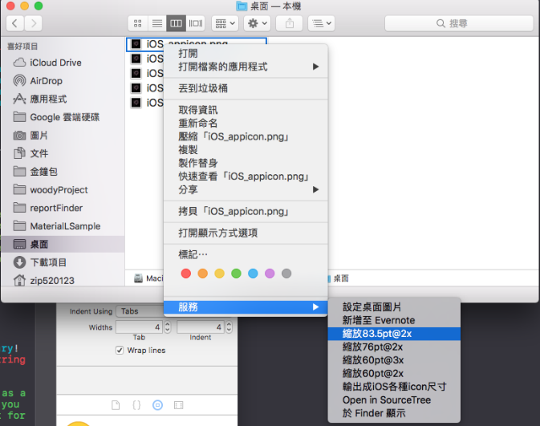
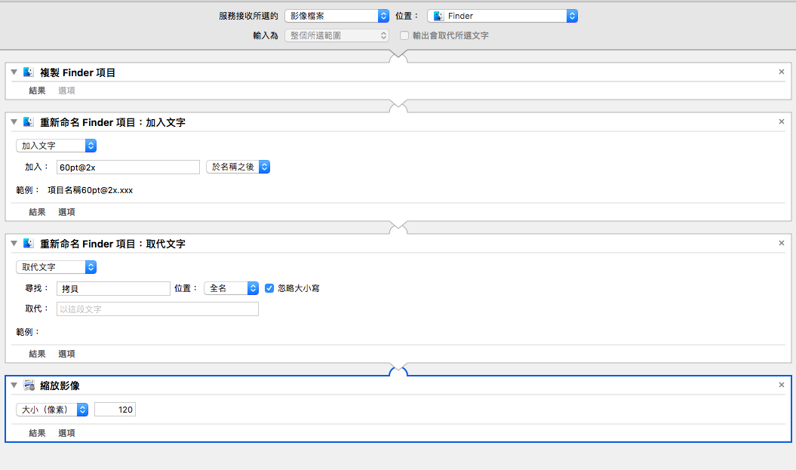

# iOS icon scale service
將圖片縮放成符合iOS規定的icon尺寸服務。

## Introduction

- iOS需要為不同的裝置提供不同尺寸的icon，用這個服務可以把icon縮放成iOS需要的尺寸。
## Usage
- clone或下載zip下來點開安裝服務。
- 安裝服務後右鍵選取一圖片，選擇服務->選擇縮放的尺寸。
- 他會複製一張圖然後縮放成該尺寸，並且在名稱後面加上@2x、@3x。
## 支援的圖片格式
- Mac 認得出來的圖片格式都可以，jpg, jpeg, png...

## How is work
Automator
